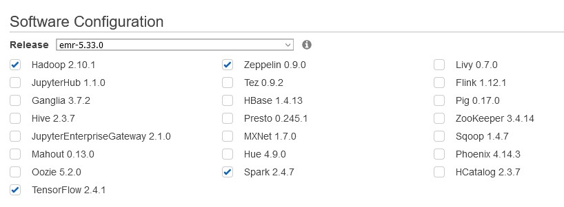

# CS205 Final Project - Group 4
## Parallelizing a chest X-ray deep learning system

## Overview
Chest X-rays are the most common diagnostic tool for used in pratice today in medicine. Integrating deep learning models medical imaging to complement radiologists has the potential to improve people's health, as well as financial costs for individuals and healthcare systems. However, in order for such system to be successful in accuracy, speed, and cost, it must first learn from many X-ray images of various chest-related pathologies, which requires a large amount of data and computing resources to train such a model in a reasonable amount of time. Our project aims to speed-up this traininng process by using big data and big compute tools, namely Spark (through Elephas) and GPU accelerated computing.


## Data
The image data is stored in a publicly available AWS S3 bucket (`s3://cs205-project-xray/images`). Each image is associated with one or more of 15 labels of disease pathologies. A csv file of the labels can be found here: `s3://cs205-project-xray/Data_Entry_2017_v2020.csv`.


## Setup

### Sequential Execution
We use a m5.xlarge instance to get our sequential code results. We use the AWS Deep Learning AMI (Id: [ami-04cd519d2f9578053](https://aws.amazon.com/marketplace/pp/Amazon-Web-Services-AWS-Deep-Learning-AMI-Ubuntu-1/B07Y43P7X5)) with Conda to provide a virtual environment as it comes pre-packaged with the libraries of our interest, like keras, tensorflow, and conda. However by default, Tensorflow uses all available CPU cores for its computation. To change this behaviour, the following piece of line needs to be added to xray_tensorflow.ipynb after the ```import tf```.
```
tf.compat.v1.keras.backend.set_session\
(tf.compat.v1.Session(config=tf.compat.v1.ConfigProto(intra_op_parallelism_threads = 1, inter_op_parallelism_threads=1)))
```
We load up the environment we want on the AMI using ```source activate tensorflow2_p36``` and run the script with ```python xray_tensorflow.py```.

### Parallel Execution
#### Shared Memory - GPU
We follow the same process as above, with the only difference being that it is run on a g3s.xlarge instance type which has 1 GPU.


### Distributed Memory - Elephas
We launch an EMR Cluster on AWS with the following setup. This gives us tensorflow out of the box, along with all Spark related dependencies.


Additionally, we can use the script ```./elephas_libs.sh``` on each host to install elephas with its required versions of PySpark. The script also installs a few other dependencies like scikit-learn and pandas.
At this point, our EMR Cluster has spark 2.4.7, elephas 2.1.0, along with the package versions listed above, and the code can now be run on the cluster.
We can do a simple ```spark-submit --driver-memory 5G xray_elephas.py``` to begin the model training.

